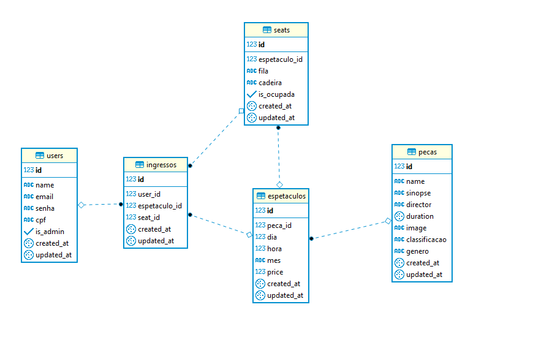

# SG-VIT

 
#

  
## Sistema de Gerenciamento de Venda de Ingressos de Teatro
 

## Screenshots

 
.
 

## Video
https://www.youtube.com/watch?v=RriuMzmcRm0&feature=youtu.be
## Requerimentos
O Sistema é dividido em duas partes **Backend** e **Frontend**
> node.js yarn postgresSQL

src/backend
> yarn add bcryptjs cors express fs jsonwebtoken multer passport-local pg pg-hstore sequelize sequelize-cli sharp socket.io

src/frontend
> yarn add axios react react-router-dom

## Iniciando a aplicação
src/backend
> yarn sequelize db:migrate 
> yarn dev

src/fronted
> yarn start

## Documento de Requisitos
|Versão|Data|Download|
|-|-|-|
|0.0.1|14/08/2019|[LINK](https://github.com/asilvadev/SG-VIT/blob/master/Docs/Documento%20de%20EOR%20-%20SG-VIT.pdf)|

## Documento de Viabilidade
|Versão|Data|Download|
|-|-|-|
|0.0.1|14/08/2019|[LINK](https://docs.google.com/document/d/1WcJmFmbdfi0pUfzN5idmCA_Hn8Ov2O_7X2nNpX1f1Jo/edit)|

## DIAGRAMAS
##### Classe

##### Casos de Uso

##### Diagrama ER

##### Diagrama MR

##### Diagrama Componente

##### Diagrama de Atividades

##### 

##### 

##### Driagrama de Sequencia

##### 

##### 

##### 

##### 

##### 

##### 

> A versão atual não suporta o modulo Funcionario. Atualizações futuras englobarão o modulo FUNCIONARIO.

## ATA
| Nº |Descrição | Data | Download |
|-|-|-|-|
|01|Levantamento de ferramentas para desenvolvimendo|12/08/2019|[LINK](https://github.com/asilvadev/SG-VIT/blob/master/ATA/ATA%2001%20-%20Levantamento%20de%20ferramentas%20para%20desenvolvimento%20-%2012.08.2019.pdf)|

## Componentes
Alan Silva 
Felipe Lima 
Thuize Thainá 
Victor Araujo 

## Contributors

Made with [contributors-img](https://contributors-img.firebaseapp.com).

